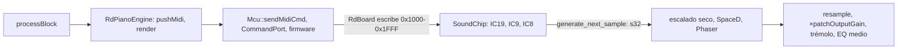

# CLAUDE.md

Emulador HW de pianos Roland SA (MKS-20 / RD-1000 / Rhodes MK-80): firmware original sobre CPU HD63701
emulada (core MAME) + chips de síntesis reimplementados gate-level. C++23; `resample/` en C23.
Estructura y diagramas: [docs/ARQUITECTURA.md](docs/ARQUITECTURA.md).

## Layout

| Ruta | Qué es |
|---|---|
| `librdpiano/` | Núcleo sin dependencias: emulador + `RdPianoEngine` (cadena de audio entera, incl. `lsp/` y `resample/`). La lógica real vive aquí. |
| `rdpiano_juce/` | Plugin JUCE 9.0.1 (VST3/AU/AUv3/LV2/Standalone), solo macOS. |
| `roms/` | Dumps, empotrados como `BinaryData` vía `juce_add_binary_data`. |
| `re_stuff/` | Ingeniería inversa (Verilog, disasm). No se compila. |
| `scripts/` | `download-juce.sh`, `build-osx.sh` (los de la CI, POSIX `sh`) sobre `common.sh`. |
| `ui/`, `docs/` | Assets del panel; capturas + `ARQUITECTURA.md`, `FIRMWARE.md`, `REVISION-CODIGO.md`. |
| `logs/` | `<script>-<fecha>-<hora>.log` por ejecución. Fuera de git; borrable entero. |
| `build/` | Solo lo generado: `juce/`, `plugin/`, `core/`, `core-asan/`. `rm -rf build` = árbol recién clonado; `rm -rf build/plugin build/core*` limpia sin re-bajar JUCE. |

## Cadena



IC19 = envolvente (IRQ al fin de segmento); IC9 = fase/dirección de wave ROM; IC8 = suma log vol+muestra.
`Ic19Out`/`Ic9Out` = bus real entre chips. `SoundChip::update()` = 16 voces × 10 partes × 3 bloques
(`tick_ic19/ic9/ic8`, inline en `sa_blocks.h`; LUT IC10/IC11 compartidas en `sa_tables.h`).
**Reloj maestro = audio**: 1 muestra → 100 **instrucciones** de CPU (62 a 32 kHz); no hay bucle de CPU aparte.

| Contrato | |
|---|---|
| Frontera motor/plugin | `RdPianoEngine` ([rd_engine.h](librdpiano/include/rd_engine.h)), sin JUCE. `prepare()` reserva todo; `render()` no reserva, no bloquea, no imprime. |
| Sin cerrojo | Tocar el emulador desde fuera = publicar una petición; la atiende `serviceRequests()` al entrar en `render()`. |
| `requestPatch()`/`requestMasterTune()` | `store` atómico, repeticiones colapsadas (necesario con un dial). |
| `setPatch()`/`setMasterTune()`/`allNotesOff()` | Corren el emulador en el acto → solo arranque y pruebas, nunca con `render()` vivo en otro hilo. |
| `patch()`/`masterTune()` vs `activePatch()` | Intención (lo pedido aunque no atendido) vs lo que suena. |

### Cambio de parche y de afinación

Premisa: `applyPatch()` manda el program change de `reloadPatch()` (única forma de que el firmware relea la
página recién mapeada; sin él el timbre sale mal, medido) y el switcharoo de `Mcu::setMasterTune()` (trampa 4)
manda dos más; todos **apagan las voces y sueltan el pedal dentro del firmware**. Lo fijan
`engine_patch_declick`, `engine_patch_held_notes`, `engine_tune_held_notes`.

| Pieza | Regla y cifras medidas |
|---|---|
| Declick | Siempre entre bloques (la tasa del emulador depende del parche y el bloque entero de ella; `processBlock` nunca espera → no se pierden bloques). Bajada 6 ms → aplicar → subida 15 ms, u 80 ms si hubo redisparo (tapa el golpe de martillo). Curva smoothstep `g²(3−2g)` (`declick_shape`), plana en 0 y 1. Medido: hueco cerrado a 45 ms, mínimo −16 dB, pico de reentrada −0,4 dB; antes, 90 ms al cuadrado = bombeo audible (−20 dB hasta los 60 ms, sin recuperar hasta los 100). Sin declick ni espejo, el dial TUNE cortaba en seco (RMS 0). |
| Orden | Afinación pendiente → `declickTune`; en el cero de la rampa, si hay las dos, **afina primero y cambia después** (al revés, los PC del afinado matan las notas que devolvió el parche). Restaurar + elegir subida = `finishChange()`, común a los dos. |
| Espejo | `heldVelocity[128]` + `sustainDown`, actualizado en `sendTracked()` (único camino de salida MIDI) → devuelve pedal y teclas aún pulsadas. Lo sostenido **solo por el pedal** no se resucita a propósito (decenas de ataques a la vez). `allNotesOff()` limpia el espejo. |
| Reentrada | Al nivel alcanzado, no al del ataque (si no: +8 a +14 dB de golpe de tecla no dado, medido). `onsetSq`/`levelSq` = ataque de la última nota / nivel actual sobre la salida cruda, en RMS² (con picos, el ataque de un acorde suma en fase y el sustain no) → decaimiento; `kDbPerVelocityUnit` = 0,228 dB/unidad (velocidad→nivel recta de v16 a v120) → velocidad a restar. Queda en ±6 dB. |

### Parches y ROMs

| Tema | Regla |
|---|---|
| Parche | ROMs de onda (IC5/6/7) + offset en `params_rom` + sample rate. `loadRomSet()` (caro) + `selectPatch()` (barato: reubica página alta, parchea bytes 0x00–0x02); `loadSounds()` = ambos. |
| Descifrado al construir | ~9 ms, 2 MB. `SoundChip`: una ranura por juego de ROM (3 × 512 KB, montón; cada dirección un `WaveEntry` `exp`+`delta`, signo en bit 15). `RdPianoEngine`: 16 páginas de params (32 KB c/u). |
| Cambio de parche | `selectRomSet()` (un puntero) + `selectPatchPage()` (memcpy 32 KB) ≈ µs → viable en el hilo de audio. `decodeRomSet`/`selectRomSet` suben por `RdBoard` y `Mcu`; `prepareRomSetFor()` = no-op. Página cacheada ≡ descifrado: `engine_patch_prepare`. |
| Program change MIDI | Lo intercepta `pushMidi()` → `requestPatch()`; reenviarlo al firmware dejaba el motor mudo (cambiaba el número, no la página). Programa = parche 0–15; mayor → ignorado y contado en `stats.programIgnored` (con `& 0x0f`, el programa 20 sonaba como el 4). Ventana de asentamiento 150 ms (`kPatchSettleMs`): el primero sale en el acto (esperar dejaría sonar con el parche viejo la nota siguiente) y los que lleguen con ella abierta se cobran uno, el último (cada cambio apaga el firmware y redispara lo pulsado). Fijan `engine_program_change_range`, `engine_patch_settle`. |
| Protocolo | 0x30/0x31/0xE0/0x50… solo en `command_port.h`; fuera, por intención (`boot()`, `selectPatch()`, `sendMidiCmd()`…). Cola = anillo fijo, cero reservas en RT. |

### Efectos y salida

| Tema | Regla y cifras |
|---|---|
| LFO de chorus y phaser | Al ritmo del **emulador** → los 5 parches de 32 kHz modulan 1,6× más rápido con el mismo panel. Deliberado: escalar por `20000/sourceRate` se implementó, se escuchó y se descartó (sonaba peor, pese a proponerlo un documento de rendimiento ya borrado). "Arreglarlo" rompe `engine_lfo_rate`. |
| Trémolo | Tras el remuestreador, fase propia acotada a 2π, `rate/2` Hz del reloj del **host** con cualquier parche (`engine_tremolo`). |
| Efectos siempre corriendo | `SpaceD::process()`/`Phaser::process()` son lo único que avanza sus líneas; saltárselos las congela y sueltan audio viejo al reactivar. Bypass = mezcla en rampa de 10 ms (`chorusMix`, `efxMix`); con 0 o 1, salida bit a bit igual. Coste +0,03 ms/bloque, constante. |
| Ganancia | `patchOutputGain[]` ([patches.h](librdpiano/include/patches.h)) normaliza los 16 parches a +6 dBFS (acorde de 16 notas, vel 127). En la salida, tras emulador y `lsp/` (aritmética entera) → no mueve golden ni hashes de `test_lsp.cpp`. Él y `volume` se interpolan **dentro** del bloque (si no: zíper y escalón de hasta 12 dB); quieto → paso 0, salida idéntica. **Sin limitador**: peor caso +10,8 dBFS con chorus de fábrica. Regenerar: `rdpiano_e2e --headroom` (idempotente). |
| `RdBiquad` | = `juce::dsp::IIR::Filter<float>` salvo `snapToZero` (no-op fuera de Intel). |
| Latencia | `latencySamples()` = retardo de grupo del remuestreador (`Xoff` a tasa del host; 67 muestras @48 kHz) → `setLatencySamples()`. Peor caso (20 kHz) a propósito: no se renegocia al cambiar de sonido. |
| Cola | `tailLengthSeconds()` = 3 s (`kTailSeconds`), doble de la cola real más larga (1,45 s a −60 dBFS, parche 5; `engine_tail_length`). Con 0 s el host cortaba el final al exportar o congelar. |

### Plugin

3 archivos + 2 tablas: `PluginParams.h` (10 parámetros, fábrica desde `RdEngineParams`), `PluginProcessor`
(APVTS, presets), `PluginEditor` (`ButtonSpec`×17, `ModeSpec`×8).

| Tema | Regla |
|---|---|
| Timer 10 Hz | El procesador recoge el parche que cambie el motor solo (program change MIDI) para espejo, preset y panel. |
| Diales parche/afinación | Aplican **al soltar** (`sliderDragEnded`); arrastrando solo enseñan nombre o Hz (cada cambio apaga el firmware). |
| Tamaño fijo a propósito | `setResizeLimits(uiWidth, uiHeight, uiWidth, uiHeight)` (mín = máx = editor no redimensionable) → **Logic escala la ventana él mismo**. `setResizable` lo rompe: Logic deja de escalar y el wrapper AU solo acepta cambios de dentro (`EditorCompHolder::resizeHostWindow()` en `parentSizeChanged`) → haría falta un asa dibujada. Probado y revertido el 2026-09-11. El arte escala por `sfC`; lo que no aguanta es el AU. |
| Repintado | `updateValues()` toca el fondo solo si se movió el fader; cada control se repinta solo; las tres hojas de arte se decodifican una vez en el constructor (nada de `ImageCache` en `paint()`); el display es una `juce::Image` rehecha solo al cambiar texto, escala o tamaño (1.190 rectángulos de 5×7 px). |
| Buses | Entrada estéreo (nunca leída: `processBlock` sobrescribe todo) + salida estéreo. No tocar → trampa 12; `plugin_bus_layout` comprueba además que lo del host no se oye. |

## Mapa de memoria

`RdBoard::read`/`write`, [rd_board.h](librdpiano/include/rd_board.h). Detalle por dirección: ARQUITECTURA §4.1.

| Rango | Qué |
|---|---|
| `0x0000-0x001F` | Registros MCU (p1=0x02 datos, p2=0x03 control, TCSR=0x08) |
| `0x0000-0x0FFF` | RAM |
| `0x1000-0x1FFF` | SoundChip |
| `0x2000-0x3FFF` | Latch de banco (2 bits; lo fija cualquier escritura ≥ 0x2000) |
| `0x4000-0xBFFF` | Params ROM, bancada por `latch_val & 0b11` |
| `0xC000-0xFFFF` | Program ROM (firmware, 8 KB) |

- `Mcu` = CPU (core MAME) + `RdBoard`. Acople solo vía `RdBoardCpu`: el handshake mira el PC; escribir en
  puerto 2 baja TIN.
- ROMs con líneas permutadas en el PCB; lo deshacen los `unscramble_*` de
  [rom_loader.h](librdpiano/include/rom_loader.h) y `SoundChip::decode_samples()` — **no tocar sin verificar audio**.
- `Mcu::reset()` reinicia **todo** el estado (registros, temporizador y, vía `RdBoard::reset()`, RAM, latch,
  cola, 160 `SA_Part`). Lo que no es estado (ROMs, página de params mapeada, tablas de onda) sobrevive → trampa 8.
- Cada part ocupa 16 bytes del mapa pero tiene 8 registros; +8..+F se descartan (RD200 solo escribe ahí ceros de arranque).

## Trampas — leer antes de modificar

| # | Trampa |
|---|---|
| 1 | **Handshake atado a direcciones del firmware RD200**: `RdBoard::read` compara el PC con `0xE12B/0xE15E/0xE168/0xE15A` → solo se carga `RD200_B.bin`. Equivalentes MKS-20 en [docs/FIRMWARE.md](docs/FIRMWARE.md). |
| 2 | El bit de sample rate del puerto 2 **no funciona** (nunca funcionó); el rate sale de `patchSampleRates[]`. [FIRMWARE §3](docs/FIRMWARE.md). |
| 3 | Dos hacks en `SoundChip::update()`: early-out `env_value==0 && env_dest==0` y silenciado condicional contra voces colgadas (`investigate`). Fijados por `test/vectors/ic_blocks.txt`. |
| 4 | `setMasterTune()` corre el emulador (~200 muestras + `programChange(0)`, ~0,16 ms): lo corre `render()` al atender la petición, no la UI. Switcharoo 0x30 → tuning → 0x30 porque afinar parches ≠ 0 falla; esos PC apagan voces y sueltan pedal → declick y devolución de lo pulsado. |
| 5 | `mcu_ops.h` y `mame_utils.h` derivan de MAME (BSD-3): no reescribir por estilo, mantener atribución. |
| 6 | `re_stuff/verilog/` es, según su README, *"probably most of them wrong"*: investigación, no verdad. |
| 7 | **Plugin y harness arrancan distinto** en parches de 32 kHz: el motor calienta a 20 kHz siempre, el harness al del parche. Cerrarlo movería el golden de 5 parches = cambio de audio. |
| 8 | `boot()` **no** pierde el parche, pero re-llamar `setPatch()` tras `prepare()` **sí cambia el audio**. Orden: seleccionar parche → preparar. Por eso `prepare()` atiende la petición pendiente **antes** de arrancar el firmware. |
| 9 | `emuCapacity` se dimensiona para 32 kHz (el parche cambia sin re-preparar) + `maxBlock/4` por el corrector de deriva. |
| 10 | `masterTune` y `currentPatch` **no son automatizables** a propósito (el parche es el *programa* del host; la afinación no es un mando de mezcla). Viajan en el preset como propiedades del árbol APVTS, con los atributos de siempre. |
| 11 | El `.lv2` se llama `rdpiano_juce.lv2` (antes `RdPiano.lv2`: `juce_add_plugin` usa `PRODUCT_NAME`); el URI no cambió. Los otros cuatro formatos conservan nombre, bundle id y códigos. |
| 12 | **El bus de entrada no se toca.** Un instrumento no lo lee y `auval` valida sin él, pero **Logic no carga la AU sin bus de entrada** (la inserta, sin interfaz y muda). Probado y revertido el 2026-09-02 (F13 de [REVISION-CODIGO.md](docs/REVISION-CODIGO.md)). Fija `plugin_bus_layout`. |
| 13 | **Abrir el Standalone desde `build/` rompe la AU en Logic.** Los cinco formatos comparten `aumu RDPN GlZs`; el `.app` registra su AUv3 empotrado, que eclipsa el `.component` instalado → Logic: *"No se ha podido cargar el módulo Audio Unit RdPiano"* (triángulo amarillo), y `auval -v aumu RDPN GlZs` dice *"version 3 implementation"* en vez de *version 2*. Deshacer: `pluginkit -r <ruta>/rdpiano_juce.app/Contents/PlugIns/rdpiano_juce.appex` + "Restablecer y volver a explorar". Instalado en `/Applications` no estorba. |
| 14 | **Note-on repetido en la misma tecla sin note-off cuelga una voz para siempre**: el firmware deja dos voces, el note-off apaga una y la otra suena sola (tono crudo, muy digital) sin que la callen note-off ni pánico. Medido de la nota 24 a la 84, a cualquier distancia, con pedal arriba y abajo; salía desde un DAW (notas solapadas) y se culpaba al cambio de parche. `sendTracked()` suelta la tecla antes de volver a pulsarla, como un piano. Fija `engine_repeated_note`. |

## Build (solo CMake; no hay Projucer ni `.jucer`)

```bash
sh scripts/download-juce.sh   # JUCE 9.0.1 → build/juce (var de caché RDPIANO_JUCE_DIR)
sh scripts/build-osx.sh ALL   # cinco formatos universales, generador Xcode
# productos en build/plugin/rdpiano_juce/rdpiano_juce_artefacts/Release/<FORMATO>/
```

| Tema | Regla |
|---|---|
| Scripts | POSIX `sh` sobre `scripts/common.sh` (incluido con `.`: paleta, log, `paso`, `cmd`, `fatal`, `fin`, trap de salida que llama a `limpiar()` si existe; `download-juce.sh` borra ahí zip y temporal). La CI invoca `sh ./scripts/…` (antes `bash -ex`). |
| Salida | CMake/Xcode **solo al log**; en pantalla una etiqueta por paso y al final tiempo, nº de avisos *distintos* (en universal salían doblados) y ruta. Fallo → últimas 40 líneas y mismo estado. Color solo en terminal (`NO_COLOR`, `TERM=dumb` o redirigida → pelado; `FORCE_COLOR=1` lo impone). 10 logs por script (`LOGS_QUE_QUEDAN`); poda el resto al abrir uno nuevo. |
| Sin repetir trabajo | `download-juce.sh` no baja nada si `build/juce` ya es la versión (`project(JUCE VERSION …)` de su raíz; `--forzar` baja igual). `build-osx.sh` solo configura si la caché no sirve (no existe, otro generador u otras arquitecturas, o sin JUCE ni plugin); el proyecto Xcode lo regenera CMake al cambiar un `CMakeLists`. ~3,4 s por invocación. |
| Universal siempre | `arm64;x86_64` en `build/plugin`; `universal` = no-op. El modo `nativo` (`build/plugin-nativo`) se quitó: ahorraba compilación y nada en ejecución (macOS carga una rebanada, mismo código, sin flags por arquitectura) y no cargaba bajo Rosetta. |
| `install` | `sh scripts/build-osx.sh AU install`: `ditto` sobre el destino ya borrado (actualizar un bundle in situ deja restos), un `sudo -v`. AU → `/Library/Audio/Plug-Ins/Components`, VST3 → `.../VST3`, LV2 → `.../LV2`, Standalone → `/Applications`. AUv3 va empotrado en el `.app` (`XCODE_EMBED_APP_EXTENSIONS`). Sin VST2 (JUCE 9) → `/Library/Audio/Plug-Ins/VST` no se toca. Sin la palabra no se escribe fuera de `build/` (lo que hace la CI). |
| Xcode | A propósito (AUv3 solo existe con él). Deployment target 11.0, pasado a `juceaide` por `MACOSX_DEPLOYMENT_TARGET` (invocación anidada sin caché). |
| Fuentes | El plugin enlaza el target `librdpiano`: `.cpp` nuevo en el núcleo = una línea en `librdpiano/CMakeLists.txt`. |

Núcleo + standalone SDL (SDL2 + portmidi, opcionales): `cmake -S librdpiano -B build/core && cmake --build build/core`.
Configurar `librdpiano/` suelto fuerza `-fsanitize=address` (intencional); desde la raíz, OFF.

CI (`.github/workflows/main.yml`): `ctest` sin ASan, `ctest` con ASan, build macOS (+ `rdpiano_plugin_tests`);
en `master` publica release rodante con tag `latest`, que depende de los tres.

## Verificar cambios

```bash
cmake -S librdpiano -B build/core -DRDPIANO_SANITIZE=OFF -DCMAKE_BUILD_TYPE=Release
cmake --build build/core --target rdpiano_tests rdpiano_e2e
ctest --test-dir build/core --output-on-failure
```

| Suite | Qué fija |
|---|---|
| **e2e** (`test/e2e.cpp`) | Headless, ~40× tiempo real, 16 parches en ~3 s (`--patch N` ~0,2 s): arranque silencioso, nota, acorde, extinción tras note-off (voces colgadas), polifonía 16, pico y **hash bit-exacto por parche** contra `test/golden.txt`. Lo mueven `sound_chip.cpp`, `unscramble_*` y el MCU. |
| **Unitaria** (`test/unit/`) | 56 suites, 522 checks, ~5 s: `test_board`, `test_patches`, `test_sa_tables`, `test_rom_loader`, `test_command_port`, `test_sound_chip_blocks` (2.256 vectores), `test_lsp` (impulso congelado), `test_resampler`, `test_engine`. `TEST_SUITE(nombre)` + una línea en el CMakeLists; andamiaje `test/check.h`. La prueba se escribe **antes** del refactor y pasa sin editarla. |
| `test_engine.cpp` | Simulador de host (bloques irregulares, 22–96 kHz, cambios de parche en caliente, extremos) y lo único que verifica **cero reservas en `render()`** (`operator new` global + `stats.resamplerOpens`, porque libresample usa `malloc`). |
| **Plugin** (`rdpiano_juce/test/`) | `rdpiano_plugin_tests`, 8 suites, 108 checks: presets ida y vuelta, fábrica, programas, preset corrupto, latencia, cola, buses. |

Red de transitorios de `test_engine`: `engine_effect_tail` (efecto encendido en silencio → silencio),
`engine_effect_bypass_ramp`, `engine_program_change`, `engine_patch_declick`, `engine_patch_held_notes`,
`engine_tune_held_notes` (acorde y pedal sobreviven al afinado, sin salto ni golpe), `engine_repeated_note`
(trampa 14), `engine_program_change_range` y `engine_patch_settle` (programa = parche 0–15, una ráfaga = un
cambio), `engine_prepare_pending_change` (trampa 8), `engine_volume_ramp`, `engine_latency`, `engine_lfo_rate`
(periodo del LFO del chorus por autocorrelación de la diferencia wet-dry; depende de la tasa del parche),
`engine_tremolo` (lo mismo sobre wet/dry por canal: periodo, oposición de fase, profundidad y ritmo del
**host**) y `engine_tail_length` (cola real de los 16 parches contra la declarada).

Plugin en el ctest de la raíz:
```bash
cmake -B build/plugin -G Xcode -DCMAKE_OSX_ARCHITECTURES="arm64;x86_64"
cmake --build build/plugin --config Release --target rdpiano_tests rdpiano_e2e rdpiano_plugin_tests
ctest --test-dir build/plugin -C Release --output-on-failure
```

**Golden y vectores no se regeneran para poner algo en verde.** Cambio de audio intencionado: `--wav-dir DIR`,
escuchar, y solo entonces `--write-golden`. Golden movido + vectores en verde = cambio en el orden de
evaluación del bucle → revertir.

- Tocar `lsp/`, `rd_engine.cpp` o `rdpiano_juce/` **no** mueve el golden (el harness mide el emulador
  desnudo): ahí la red es `test_engine.cpp` y `test_lsp.cpp`.
- Sin cubrir: la UI (incluidos los diales) y sobre todo el **timbre**: los hashes detectan, no juzgan.
  Verificación auditiva con `test/standalone.cpp` o el plugin en un DAW. Un cambio en `sound_chip.cpp` que
  pase el harness pero mueva el hash es de **alto riesgo tímbrico: decírselo al usuario**.
- `rdpiano_e2e --headroom` no es comprobación ni entra en ctest: mide y reescribe `patchOutputGain[]`.

## Versión y changelog

- **Versión oficial** = el `VERSION` de `juce_add_plugin` ([rdpiano_juce/CMakeLists.txt](rdpiano_juce/CMakeLists.txt)),
  y no hay otra: de ahí salen `CFBundleShortVersionString`/`CFBundleVersion`, las versiones del `.ttl` del LV2
  y `JucePlugin_Version*`. A mano a propósito: omitirla hereda el `project()` de la raíz (hoy `1.0`), que no
  es versión de producto. Publicar = cambiar esa línea + entrada en el changelog.
- `CHANGELOG.md` (raíz): **una entrada por versión, la más nueva arriba**, en **español estándar, breve y
  conciso, con el menor lenguaje técnico posible** — lo que nota quien toca el plugin. Nada de nombres de
  función, rutas ni hashes: eso vive aquí y en `docs/`.

## Convenciones

- 4 espacios, llave aparte (Allman), 120 columnas: lo que dice `.clang-format` (todo el árbol propio ya
  formateado). Solo quedan tabs de MAME en los exceptuados.
- **Todo archivo C/C++ nuevo o modificado se formatea** (Format Document `⇧⌥F`, o `.clang-format` por CLI).
  Masivo solo en commit aislado:
  ```bash
  CF=~/.vscode/extensions/ms-vscode.cpptools-*/LLVM/bin/clang-format
  git diff --name-only --diff-filter=ACMR -- '*.c' '*.h' '*.cpp' | xargs $CF -i
  ```
- **Exceptuados de formateo y documentación**: `mcu_ops.h`, `mame_utils.h`, `lsp/`, `resample/`, `re_stuff/`.
- El núcleo no conoce JUCE ni `stdio` (tampoco `rd_engine.cpp`, `lsp/`, `resample/`); las cabeceras no
  incluyen stdlib salvo `<stddef.h>`/`<cstdint>` y el `<atomic>` de `rd_engine.h`; la traza sale por
  `RD_TRACE` (`rd_trace.h`), no-op sin `-DRDPIANO_TRACE`.
- Tipos MAME (`u8/s16/u32`) en el núcleo, tipos JUCE en el plugin.
- `HACK:` / `TODO:` marcan comportamiento conocido-incorrecto: son contexto, no ruido.
- `patches.h` (offsets, sample rates, nombres, ROM set, headroom) lo comparten plugin y harness.

## Estándar de documentación

Doxygen **en español, breve y conciso**, sobre la **declaración** y nunca dentro del cuerpo: `/** */` con
`@brief` en primera línea, `@param`/`@return` solo si el nombre no lo dice ya, `///<` para campos y constantes.
Los `#` de Doxygen no se usan (nombre a secas o backticks). Lo que no se deduce del código (contratos de RT,
trampas) va a este CLAUDE.md o a `docs/`, no a comentarios largos.

```cpp
/**
 * @file rd_engine.h
 * @brief Una línea de qué contiene el archivo.
 */

/**
 * @brief Qué es la clase, en una línea.
 *
 * Por qué existe o qué contrato tiene, si no se deduce. Dos o tres líneas como
 * mucho; lo demás va a CLAUDE.md o a docs/.
 */
class Ejemplo
{
  public:
    static constexpr int kTope = 16; ///< Qué acota.

    /**
     * @brief Qué hace, en imperativo.
     * @param patch Qué significa, no de qué tipo es.
     * @return Qué devuelve, y qué quiere decir el caso raro.
     */
    bool selectPatch(int patch);
};
```

| Regla | |
|---|---|
| Qué se documenta | Todo archivo (`@file` + `@brief`), toda clase, struct y enum, y los métodos públicos. Nada en los `override` de JUCE, getters obvios ni destructores; constructores solo si el orden de llamada importa. |
| El `.cpp` | No repite la cabecera: solo `HACK:`/`TODO:` y la razón de una constante medida. Lo que solo existe en el `.cpp` (helpers en anónimo) se documenta ahí. |
| Sin comentarios interlineados | El código se explica solo; si no, se renombra o se parte en una función con nombre. Excepciones: `HACK:`/`TODO:`, las trampas, los números mágicos del hardware (direcciones, bytes del protocolo, opcodes) y los valores medidos a oído o con el harness. |
| Pruebas | `@file` por archivo y `@brief` sobre cada `TEST_SUITE` diciendo qué fija. Dentro sí se comenta lo que un `CHECK` no dice solo: qué invariante mide. |

## Git: no commitear

Nunca `git commit`, `push`, `add`, ni crear ramas o tags. Dejar los cambios en el árbol de trabajo y decir qué se
tocó. Git en modo lectura (`status`, `diff`, `log`, `show`) sí.
