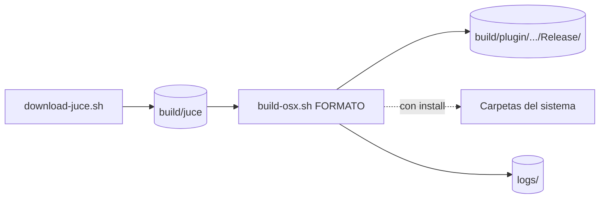

# Compilar RdPiano desde el código

> 🧑‍💻 **Esta página es para gente con experiencia.** Para tocar no necesitas nada de esto: descarga el
> plugin ya compilado siguiendo la [instalación del README](README.md#instalación).

Requiere macOS con Xcode.

```bash
git clone https://github.com/claudiodevia/rdpiano.git && cd rdpiano
sh scripts/download-juce.sh   # JUCE 9.0.1 en build/juce
sh scripts/build-osx.sh ALL   # los cinco formatos
```



| Argumento | Qué hace |
|---|---|
| `ALL` o un formato: `AU`, `AUv3`, `LV2`, `Standalone`, `VST3` | Compila eso, siempre universal (arm64 y x86_64), en `build/plugin/rdpiano_juce/rdpiano_juce_artefacts/Release/` |
| `install` (opcional, detrás) | Además hace por ti el [paso 2 de la instalación](README.md#paso-2--guárdalo-en-su-carpeta): copia cada formato a su carpeta, reemplazando lo que hubiera, y pide la contraseña una sola vez. AUv3 viaja dentro de la aplicación |

```bash
sh scripts/build-osx.sh AU install    # compila el .component y lo instala
```

Sin `install` no se escribe nada fuera de `build/`. Lo que compilas tú no queda en cuarentena: el
[paso 3](README.md#paso-3--dile-al-mac-que-puede-abrirlo) sobra. Por pantalla sale una etiqueta por paso
y, al final, el tiempo y la ruta de los productos; la salida de CMake y Xcode va a `logs/`. Lo ya hecho no
se repite.

## El repositorio por dentro

| Directorio | Contenido |
|---|---|
| `librdpiano/` | El emulador y la cadena de audio completa, sin dependencias externas. Aquí vive la lógica real. |
| `rdpiano_juce/` | El plugin (VST3, AU, AUv3, LV2 y Standalone), construido con JUCE. |
| `roms/` | Los volcados de ROM, empotrados en el binario al compilar. |
| `re_stuff/` | Material de la ingeniería inversa (Verilog, desensamblados), con fines educativos. No se compila. |
| `scripts/` | Los dos scripts de compilación, los mismos que ejecuta la CI. |
| `docs/` | Documentación técnica (abajo). |

Todo lo generado, JUCE incluido, vive bajo `build/`: `rm -rf build` deja el árbol recién clonado.

El núcleo se compila y se prueba sin JUCE (configurado así, con AddressSanitizer; la app interactiva
`rdpiano_standalone` solo se genera si hay SDL2 y portmidi):

```bash
cmake -S librdpiano -B build/core && cmake --build build/core
ctest --test-dir build/core --output-on-failure
```

## Documentación técnica

Los dieciséis sonidos salen de las ROM del **MKS-20** y del **MK-80**, pero el programa que las interpreta
es el del **RD-1000** (`roms/RD200_B.bin`), y solo ése: el diálogo con el bus depende de direcciones fijas
de ese firmware.

| Documento | Qué cuenta |
|---|---|
| [ARQUITECTURA.md](docs/ARQUITECTURA.md) | Cómo está construido el sistema, con diagramas. |
| [FIRMWARE.md](docs/FIRMWARE.md) | Qué programa interno ejecuta y por qué solo ése. |
| [REVISION-CODIGO.md](docs/REVISION-CODIGO.md) | La revisión del código y lo que se hizo con cada hallazgo. |
| [CLAUDE.md](CLAUDE.md) | Trampas antes de tocar nada, cifras medidas, pruebas y convenciones. |
