# Arquitectura de RdPiano

**Alcance:** `librdpiano/`, `rdpiano_juce/`, `roms/`, build y CI. **Árbol:** `develop` @ `db47f7b` (2026-09-21).

Este documento dice *cómo está construido* el sistema. Lo demás vive en su sitio:

| Tema | Dónde |
|---|---|
| Trampas (leer **antes** de modificar), cifras medidas, build, convenciones | [CLAUDE.md](../CLAUDE.md) |
| Qué firmware corre, handshake por PC, bit de sample rate, bucle de CPU | [FIRMWARE.md](FIRMWARE.md) |
| Qué se revisó y qué se hizo con ello | [REVISION-CODIGO.md](REVISION-CODIGO.md) |
| Compilar e instalar | [COMPILAR.md](../COMPILAR.md) |

## Índice

1. [Qué es](#1-qué-es)
2. [Componentes y frontera](#2-componentes-y-frontera)
3. [Clases](#3-clases)
4. [Emulador](#4-emulador)
5. [`RdPianoEngine`](#5-rdpianoengine)
6. [Plugin](#6-plugin)
7. [Concurrencia](#7-concurrencia)
8. [Vida de una nota](#8-vida-de-una-nota)
9. [Pruebas](#9-pruebas)
10. [Plataforma, build y CI](#10-plataforma-build-y-ci)
11. [`re_stuff/`](#11-re_stuff)
12. [Puntos frágiles](#12-puntos-frágiles)

---

## 1. Qué es

Un emulador **de hardware** de la placa CPU-B que Roland usó en MKS-20, RD-1000 y Rhodes MK-80: el
**firmware original** corre byte a byte sobre una HD63701 emulada (core MAME) y programa una
reimplementación *gate-level* de los tres chips de síntesis (IC19, IC9, IC8).

Dos reglas que gobiernan todo lo demás:

- **No hay `noteOn()`.** Un Note On se traduce a bytes del protocolo interno CPU-A → CPU-B, se encola, y
  la CPU emulada tiene que ejecutar hasta que el firmware lo consuma y escriba en el chip de sonido.
  Asignación y robo de voces, curvas de velocidad y pedal son decisiones del firmware, no de RdPiano.
- **El reloj maestro es el audio.** No hay bucle de CPU aparte: cada muestra, `Mcu::generate_next_sample()`
  saca una muestra del chip y ejecuta 100 instrucciones (62 en los parches de 32 kHz).

## 2. Componentes y frontera

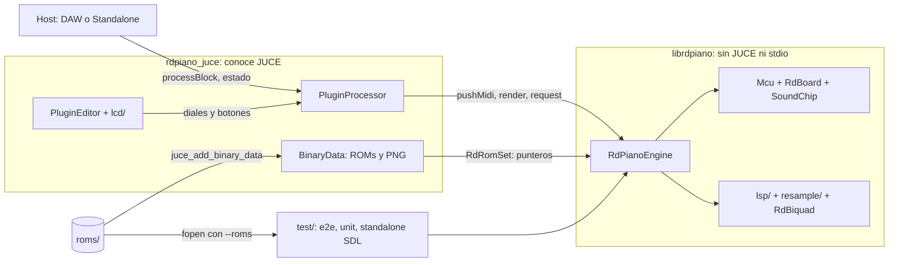

La frontera está en **`RdPianoEngine`** ([rd_engine.h](../librdpiano/include/rd_engine.h)), no en el
emulador: efectos, remuestreo, EQ, reparto del MIDI y declick son C++ puro. El plugin solo traduce
parámetros → `RdEngineParams`, `juce::MidiBuffer` → `pushMidi()`, `AudioBuffer` → los dos punteros de
`render()`. Las ROMs van empotradas en el plugin; solo harness, suite unitaria y standalone SDL las leen
de disco.

| Método | Contrato |
|---|---|
| `prepare(hostRate, maxBlock)` | Reserva **todo** y arranca el firmware. Idempotente. |
| `render(l, r, n)` | No reserva, no bloquea, no imprime. |
| `pushMidi(frame, …)` | Cola fija de 512 eventos. Program change → `requestPatch()`. |
| `requestPatch()` / `requestMasterTune()` | Un `store` atómico. Desde cualquier hilo. |
| `setPatch()` / `setMasterTune()` / `allNotesOff()` | Corren el emulador **en el acto**: solo arranque y pruebas. |

Dependencias no obvias:

- `mcu_ops.h` no es una cabecera autónoma: se incluye a mitad de `mcu.cpp` porque sus ~250 handlers usan
  las macros (`PC`, `EAD`, `SET_NZ8`, `RM`, `WM`…) definidas justo antes. Derivado de MAME (trampa 5).
- `rd_engine.cpp` incluye `resample/libresample.h` (C, `extern "C"`); ninguna cabecera del núcleo lo expone.

## 3. Clases

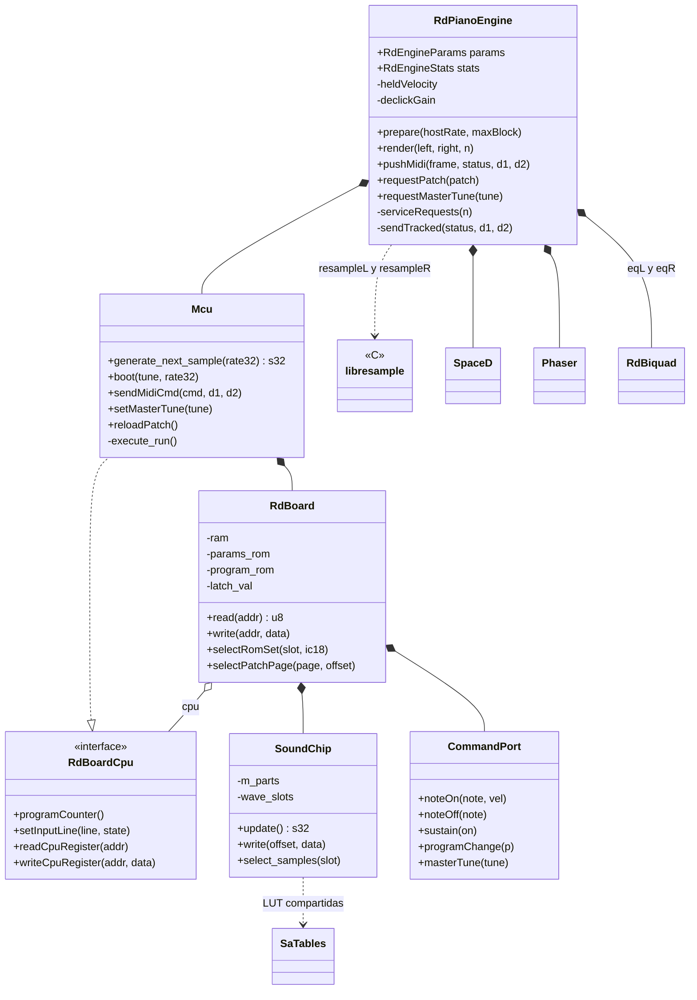

`Mcu` es lo que hay **dentro** del chip (instrucciones, registros, temporizador, interrupciones);
`RdBoard`, lo **soldado al bus**. `RdBoardCpu` es todo lo que la placa necesita de la CPU: el PC (lo mira
el handshake), las líneas de interrupción y los registros de `0x0000-0x001F`, que son del chip.

## 4. Emulador

### 4.1 Mapa de memoria

`RdBoard::read`/`write`, `inline` en [rd_board.h](../librdpiano/include/rd_board.h) (dos o tres accesos
por instrucción). El orden de las ramas y las máscaras son del hardware: el golden los mide.

| Rango | Qué | Detalle |
|---|---|---|
| `0x0000-0x0001` | Dirección de puertos | Escritura ignorada; lectura → registro de CPU |
| `0x0002` | Puerto 1: datos CPU-A ↔ CPU-B | Lectura = handshake ([FIRMWARE §2](FIRMWARE.md#2-por-qué-el-firmware-no-es-intercambiable-el-handshake-por-pc)); `0xFF` si no hay byte |
| `0x0003` | Puerto 2: control | Lectura `0xFF` en `0xE15A`, si no `0x00`. Escribir baja TIN |
| `0x0004-0x001F` | Registros de CPU | `0x08` TCSR; `0x0D/0x0E` captura de entrada |
| `0x0020-0x0FFF` | RAM | `ram[0x1000]` |
| `0x1000-0x1FFF` | `SoundChip` | Lectura = `m_irq_id`. Escribir con IRQ pendiente la baja |
| `0x2000-0x3FFF` | Latch de banco | Se usan 2 bits. **Toda** escritura ≥ `0x2000` fija `latch_val`, también en las ventanas de ROM |
| `0x4000-0xBFFF` | Params ROM | 32 KB de 128 KB, banco = `latch_val & 0b11` |
| `0xC000-0xFFFF` | Program ROM | 8 KB espejados: `(addr-0xC000) & 0x1FFF`; los vectores caen al final del dump |

### 4.2 Interrupciones y temporización

| Fuente | Vector | Se dispara cuando |
|---|---|---|
| ICI (captura de entrada) | `0xFFF6` | La cola de comandos no está vacía → `M6801_TIN_LINE` |
| IRQ1 | `0xFFF8` | `SoundChip::m_irq_triggered`: acabó un segmento de envolvente |
| NMI / RESET | `0xFFFC` / `0xFFFE` | NMI no se usa; RESET en `Mcu::reset()` |

`execute_run()` sondea las líneas y ejecuta **una instrucción**; `generate_next_sample()` lo llama 100
veces (62 a 32 kHz). Son instrucciones, no ciclos: ~3× el reloj real. Detalle en
[FIRMWARE §4](FIRMWARE.md#4-el-bucle-de-ejecución-y-su-failsafe).

`Mcu::reset()` reinicia todo el **estado** (registros, temporizador y, vía `RdBoard::reset()`, RAM, latch,
cola y las 160 `SA_Part`); lo que es **configuración** (ROMs, página de params mapeada, tablas de onda)
sobrevive. Por eso `boot()` no pierde el parche (trampa 8).

### 4.3 `CommandPort`: el protocolo

Bytes del bus interno, **no MIDI**. Única definición: [command_port.h](../librdpiano/include/command_port.h).

| Intención | Bytes | Origen |
|---|---|---|
| Program change | `0x30 \| (n & 0xF)` | `boot()`, `reloadPatch()` (`0x31`, `0x30`), switcharoo |
| Note On | `0xC0`, nota, velocidad | MIDI `9n` con velocidad > 0 |
| Note Off | `0xB0`, nota, `0x00` | MIDI `8n` o `9n` con velocidad 0 |
| Sustain | `0x5F` / `0x50` | CC 64 (≥ 64 = pisado) |
| Master tune | `0xE0`, msb, lsb | `encode_master_tune()`: 16 pasos de 4, tope `0x3C` |
| Pánico | `0x50` + 128 Note Off | `allNotesOff()`; CC 120/123 **no** lo disparan |

Pitch bend, otros CC y aftertouch se descartan. La cola es un anillo fijo de 1024 bytes; al desbordar
descarta **el byte nuevo** (tirar por delante partiría un mensaje a medio leer).

### 4.4 `SoundChip`: IC19 → IC9 → IC8

`update()` = 16 voces × 10 partes = **160 slots por muestra** (3,2 M por segundo a 20 kHz). Cada slot
pasa por tres bloques `inline` en [sa_blocks.h](../librdpiano/include/sa_blocks.h), y entre ellos viaja
el bus real (`Ic19Out`, `Ic9Out`):

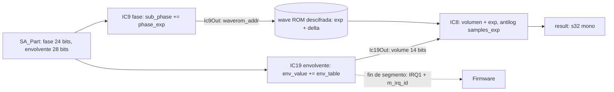

- **Todo el camino es logarítmico**: el volumen se *suma* al exponente y `samples_exp` vuelve a lineal.
  La interpolación es un segundo tap (`delta` escalado por `addr_table[(sub_phase >> 5) & 0xF]`).
- **Las LUT se generan**, evaluando bit a bit la lógica de las ROM IC10/IC11 y de los gate arrays
  ([sa_tables.h](../librdpiano/include/sa_tables.h)): `phase_exp` 256 KB + `samples_exp` 64 KB = 320 KB
  **compartidos** por todas las instancias. `env_table` y `addr_table` son constantes de `sa_blocks.h`.
- **Las muestras** son por instancia: una ranura de 512 KB por juego de ROM, `WaveEntry { exp, delta }`
  con el signo en el bit 15 (768 → 512 KB, una línea de caché por lectura).

Escritura en el chip: `voz = offset / 0x100`, `parte = (offset % 0x100) / 0x10`, `campo = offset % 0x10`.

| Campo | 0 / 1 | 2 | 3 | 4 | 5 | 6 | 7 | 8–F |
|---|---|---|---|---|---|---|---|---|
| Registro | pitch hi / lo | loop | dirección alta de onda | destino env. | velocidad env. | flags (van a la parte 0: son de voz) | offset env. | se descartan |

Los dos hacks de `update()` (trampa 3, fijados por los 2.256 vectores de `test/vectors/ic_blocks.txt`):
el atajo `env_value == 0 && env_dest == 0` (salta el slot y pone `sub_phase` a 0: tiene efecto funcional)
y el silenciado `if (env_value != 0)` *"investigate"*.

### 4.5 ROMs

Líneas de dirección y datos permutadas por el trazado del PCB, no por protección.

| ROM | Tamaño | Descifrado |
|---|---|---|
| Programa `RD200_B.bin` | 8 KB | `unscramble_addr_cpub` (bitswap 14) + `unscramble_data_cpub` (bitswap 8) |
| Params `IC18` | 128 KB | `unscramble_addr_params` (bitswap 17) + el mismo bitswap de datos |
| Onda `IC5`/`IC6`/`IC7` | 3 × 128 KB | Dirección: inversión de bits 1, 3, 5, 8, 9 + `unscramble_addr_wave`. Datos: cada `exp` (14 + signo) y `delta` (9 + signo) se reensambla con bits sueltos, algunos invertidos, de las **tres** ROM, en `SoundChip::decode_samples()` |

Las permutaciones de dirección y datos viven en [rom_loader.h](../librdpiano/include/rom_loader.h); el
reensamblado de la onda, en [sound_chip.cpp](../librdpiano/src/sound_chip.cpp). Tocar cualquiera mueve
los 16 hashes de `golden.txt` (y `test_rom_loader`): el harness lo detecta, el timbre se juzga de oído.

### 4.6 Parches

Parche = juego de ROM de onda + offset en la params ROM + tasa. Seis tablas paralelas en
[patches.h](../librdpiano/include/patches.h) (`patchNames`, `patchToRomSetId`, `patchToOffset`,
`patchSampleRates`, `patchOutputGain`, `romSetFiles`), cerradas con `static_assert`.

| # | Parche | Juego | kHz | # | Parche | Juego | kHz |
|---|---|---|---|---|---|---|---|
| 0 | MKS-20 Piano 1 | MKS20_A | 20 | 8 | MK-80 Classic | MK80 | 20 |
| 1 | MKS-20 Piano 2 | MKS20_A | 20 | 9 | MK-80 Special | MK80 | 20 |
| 2 | MKS-20 Piano 3 | MKS20_A | 20 | 10 | MK-80 Blend | MK80 | 20 |
| 3 | MKS-20 Harpsichord | MKS20_B | **32** | 11 | MK-80 Contemporary | MK80 | **32** |
| 4 | MKS-20 Clavi | MKS20_B | **32** | 12 | MK-80 A. Piano 1 | MK80 | 20 |
| 5 | MKS-20 Vibraphone | MKS20_B | 20 | 13 | MK-80 A. Piano 2 | MK80 | 20 |
| 6 | MKS-20 E-Piano 1 | MKS20_B | 20 | 14 | MK-80 Clavi | MK80 | **32** |
| 7 | MKS-20 E-Piano 2 | MKS20_B | **32** | 15 | MK-80 Vibraphone | MK80 | 20 |

Lo caro se hace **al construir el motor** (~9 ms): los 3 juegos descifrados en su ranura del
`SoundChip` y las 16 páginas de params (32 KB cada una) en `RdPianoEngine`. Cambiar de parche después:

1. `selectRomSet()`: mover un puntero, solo si cambia el juego.
2. `selectPatchPage()`: `memcpy` de 32 KB a `params_rom[0x8000]` (banco 1).
3. Parchear `params_rom[0x00-0x02]` = `{0x01, hi, lo}`: un puntero *banco + dirección* en `0x4000` que
   lleva al firmware al parche elegido **sin tocar el firmware**.

Total: microsegundos, viable desde el hilo de audio. `loadRomSet()` + `selectPatch()` (= `loadSounds()`)
siguen para quien no precalcula; `prepareRomSetFor()` es un no-op de compatibilidad.

## 5. `RdPianoEngine`

### 5.1 Un bloque

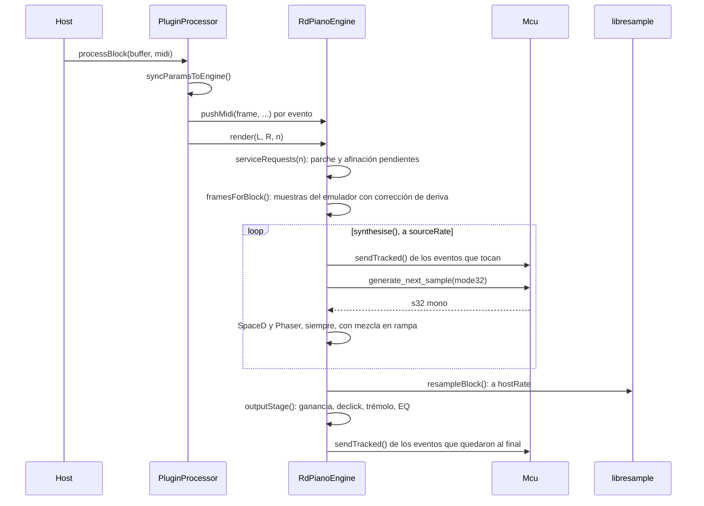

### 5.2 Cadena de audio

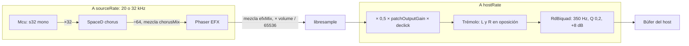

| Pieza | Qué hay que saber |
|---|---|
| Estéreo | Falso hasta el chorus: el emulador es mono, SpaceD separa L/R. |
| `×32` / `÷64` | Adaptan el rango al punto fijo de 24 bits de `lsp/`; no son ganancia arbitraria. |
| Efectos | Corren **siempre**; bypass = mezcla en rampa de 10 ms. LFO al ritmo del **emulador** (1,6× en 32 kHz, deliberado: `engine_lfo_rate`). |
| `volume`, `patchOutputGain` | Interpolados **dentro** del bloque; con el valor quieto, paso 0 y salida idéntica. |
| Declick | Tras el remuestreador: ahí el cero es cero, sin cola del parche viejo. |
| Trémolo | Fase propia acotada a 2π, `rate/2` Hz del reloj del **host**. |
| `RdBiquad` | `juce::dsp::IIR::Filter<float>` sin JUCE (salvo `snapToZero`); afinado de oído contra un MKS-20. |

Cifras (headroom +6 dBFS, peor caso +10,8 dBFS, coste de los efectos, latencia, cola): CLAUDE.md,
*Efectos y salida*.

**`lsp/`** (`spaced.cpp`, `phaser.cpp`) son transcripciones del microcódigo del DSP de efectos:
acumuladores `accA`/`accB`, IRAM circular `(memOffs + bufferPos) & 0x7f`, y en SpaceD una ERAM de 64 K
palabras (256 KB) para las líneas largas. Variables `accA_370` = pasos del microprograma; las tablas
`spaceD*Table`/`phaser*Table` son volcados de la máquina. Respuesta al impulso congelada por hash en
`test_lsp.cpp`. Excluido de formateo y documentación.

**Remuestreo**: libresample (Mazzoni, sobre `resample-1.7` de J. O. Smith), sinc con ventana. Hace falta
porque el emulador solo corre a 20 o 32 kHz. Los dos handles se abren en `prepare()` para todo el rango
de factores (`hostRate/32000 … hostRate/20000`) y no se reabren al cambiar de parche (`resample_open()`
≈ 600 KB y 2,5 ms; lo vigila `stats.resamplerOpens`). La deriva se corrige por bloque en
`framesForBlock()` cuando el error acumulado pasa de `numFrames/4`.

### 5.3 Cambios que apagan el firmware

El program change de `reloadPatch()` y el switcharoo de `setMasterTune()` apagan voces y sueltan el pedal
**dentro del firmware**. El motor lo disimula con declick y devolviendo lo pulsado:

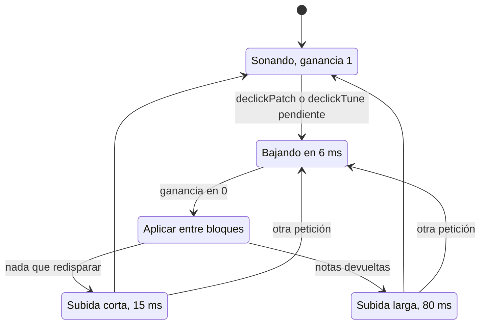

Curva smoothstep `g²(3−2g)`, plana en 0 y en 1. Si hay parche **y** afinación pendientes, **afina primero**.

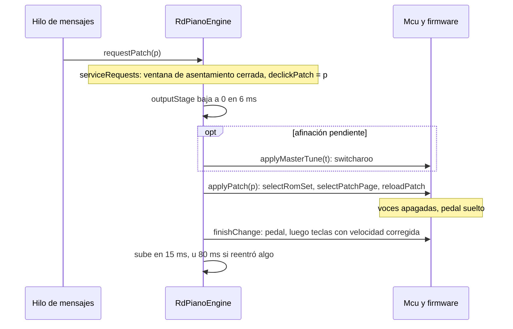

El **switcharoo** de afinación (trampa 4), en `Mcu::setMasterTune()`:

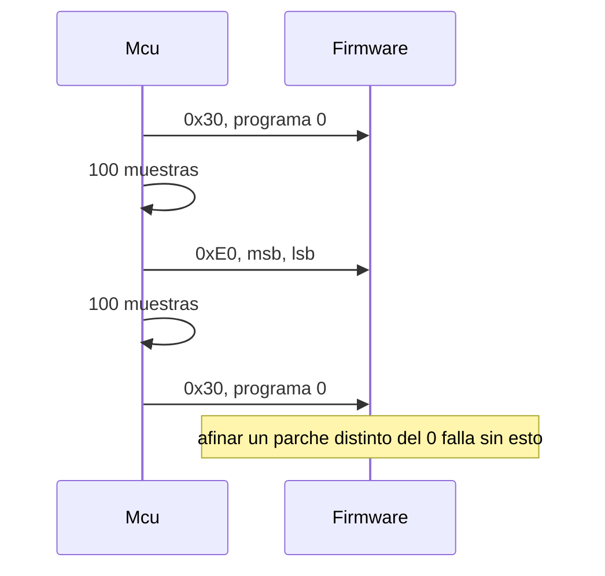

**Espejo y reentrada.** `sendTracked()`, único camino de salida MIDI, apunta `heldVelocity[128]` y
`sustainDown`, y suelta una tecla antes de volver a pulsarla (trampa 14). `restoreHeldNotes()` devuelve
el pedal y **solo** las teclas aún pulsadas, con la velocidad rebajada según cuánto decayó la salida
cruda (`onsetSq` → `levelSq`, en RMS²). Constantes y resultados medidos: CLAUDE.md, *Cambio de parche y
de afinación*.

**Program change MIDI**: `pushMidi()` lo convierte en `requestPatch()`; nunca llega al firmware.

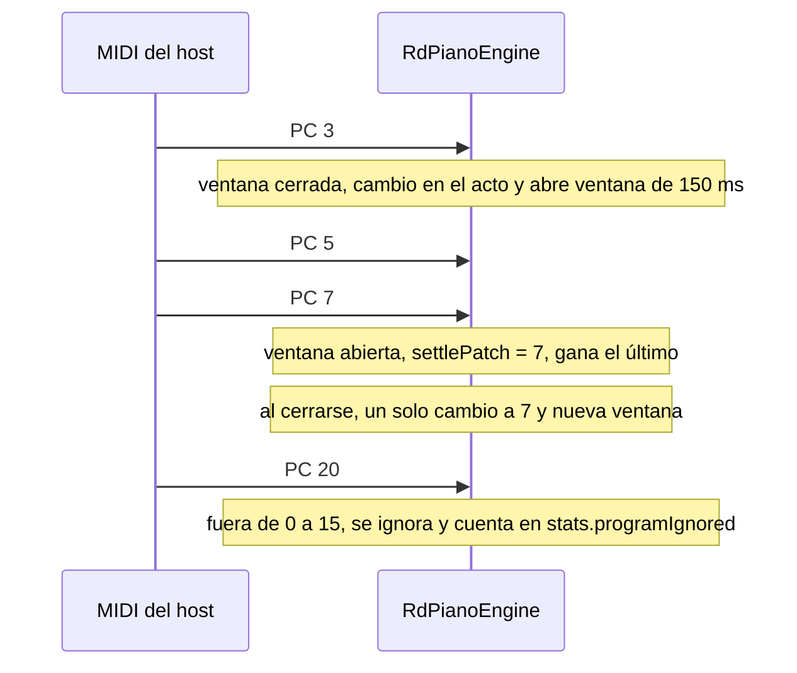

## 6. Plugin

Tres archivos y dos tablas; todo lo que no es JUCE está en el núcleo.

**Parámetros** — tabla única en [PluginParams.h](../rdpiano_juce/Source/PluginParams.h), valores de fábrica
sacados literalmente de `RdEngineParams`. El `id` va en el preset (renombrarlo rompe sesiones) y el orden
es el que ve el host (solo se añade al final).

| `id` | Tipo | Rango | Fábrica |
|---|---|---|---|
| `volume` | float | 0–1 | 1,0 |
| `chorusEnabled` | bool | | sí |
| `chorusRate` / `chorusDepth` | int | 0–14 | 5 / 14 |
| `tremoloEnabled` | bool | | no |
| `tremoloRate` / `tremoloDepth` | int | 0–14 | 6 / 6 |
| `efxEnabled` | bool | | no |
| `efxPhaserRate` / `efxPhaserDepth` | float | 0–1 | 0,4 / 0,8 |

Los int se muestran como 1–15. `masterTune` y `currentPatch` **no** son parámetros (trampa 10): viajan como
propiedades de la raíz `<RdPiano>` del árbol APVTS.

| `PluginProcessor` | |
|---|---|
| `processBlock` | Sincroniza parámetros, pasa el MIDI y llama a `render()`. La entrada no se lee nunca. |
| `setCurrentProgram` | Sale si el parche no cambia; si no, `requestPatch()` + espejo + `sendChangeMessage()`. 16 programas. |
| `timerCallback` a 10 Hz | Recoge el parche que cambió un program change MIDI (`engine->patch()`) para panel, preset y host. |
| Buses | Entrada estéreo (nunca leída) + salida estéreo. Trampa 12. |
| Latencia / cola | `latencySamples()` (peor caso, 20 kHz) / `tailLengthSeconds()` = 3 s. |

**`PluginEditor` + `Lcd`** — foto del panel, tamaño fijo (CLAUDE.md, *Plugin*), guiado por `ButtonSpec`×17
y `ModeSpec`×8. El dial alfa es modal como en la máquina: su efecto depende del modo, y los botones
"params" ciclan entre `kModePatch`, `kModeTune`, `kModeChorusRate/Depth`, `kModeTremoloRate/Depth`,
`kModePhaserRate/Depth`. Parche y afinación aplican **al soltar** el dial. `Lcd` guarda bytes, no
`juce::String` (el `0xff` de la barra salía en UTF-8 de dos bytes). UI ↔ procesador por
`ChangeBroadcaster` + el temporizador.

## 7. Concurrencia

**Sin cerrojo.** Hubo un `juce::SpinLock` (UI hacía `loadSounds()` y el audio giraba en vacío) y se quitó:
el emulador es del hilo de audio y tocarlo desde fuera es **publicar una petición**.

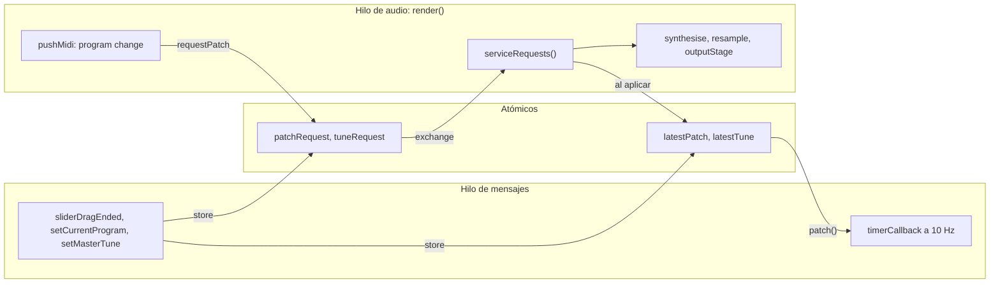

| Propiedad | Consecuencia |
|---|---|
| `processBlock` no espera | No hay sección crítica: no se pierden bloques por mucho que se toque el panel. |
| Peticiones colapsadas | Barrer el dial deja una sola petición pendiente. |
| Intención ≠ realidad | `patch()`/`masterTune()` = lo pedido (lo que enseña la UI); `activePatch()`/`activeMasterTune()` = lo que suena. Sin eso el panel parpadea. |
| Vías síncronas | `setPatch()`/`setMasterTune()`/`allNotesOff()` con `render()` vivo = carrera. |
| `prepare()` | Atiende la petición pendiente **antes** de `boot()` (trampa 8); fija `engine_prepare_pending_change`. |
| Diagnóstico | `RdEngineStats`: contadores no atómicos; el núcleo no imprime en el hilo de audio. |

## 8. Vida de una nota

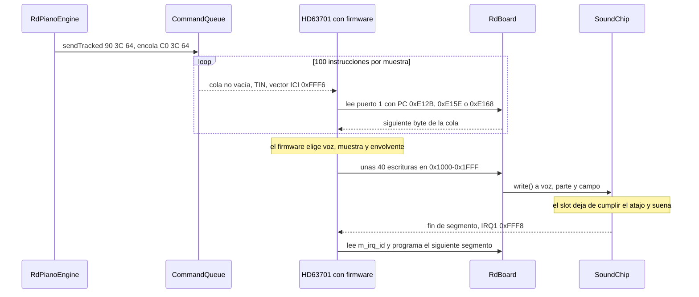

Después la muestra sigue la cadena de §5.2.

## 9. Pruebas

| Suite | Qué es | Tamaño |
|---|---|---|
| `rdpiano_tests` | Unitaria, `librdpiano/test/unit/` | 56 suites, 522 comprobaciones, ~5,5 s |
| `rdpiano_e2e` | Harness bit-exacto contra `golden.txt` | 16 parches, ~2,5 s |
| `rdpiano_plugin_tests` | Presets, programas, buses, latencia y cola | 8 suites, 108 comprobaciones |

Qué fija cada suite, la red de transitorios de `test_engine.cpp` y la regla sobre golden y vectores:
CLAUDE.md, *Verificar cambios*. Ninguna prueba juzga el **timbre** ni la UI.

## 10. Plataforma, build y CI

Todo el código es portable (ni un `#ifdef` de plataforma propio; solo `resample_defs.h`, de terceros),
pero solo se compila en **macOS**: C++23 (C23 en `resample/`), JUCE 9.0.1, CMake con generador Xcode.

| Formato | Producto | Nota |
|---|---|---|
| AU | `AU/rdpiano_juce.component` | `aumu RDPN GlZs`, compartido por los cinco (trampa 13) |
| AUv3 | `AUv3/rdpiano_juce.appex` | Empotrado en el `.app`; sin destino de instalación propio |
| VST3 | `VST3/rdpiano_juce.vst3` | |
| LV2 | `LV2/rdpiano_juce.lv2` | Trampa 11 |
| Standalone | `Standalone/rdpiano_juce.app` | |

Bajo `build/plugin/rdpiano_juce/rdpiano_juce_artefacts/Release/`, siempre universal (`arm64;x86_64`).
Sin firma ni notarización: el README explica el `xattr` de cuarentena. Recursos empotrados como
`BinaryData`: el plugin es autocontenido. Scripts, destinos de `install` y versión: CLAUDE.md, *Build* y
*Versión*.

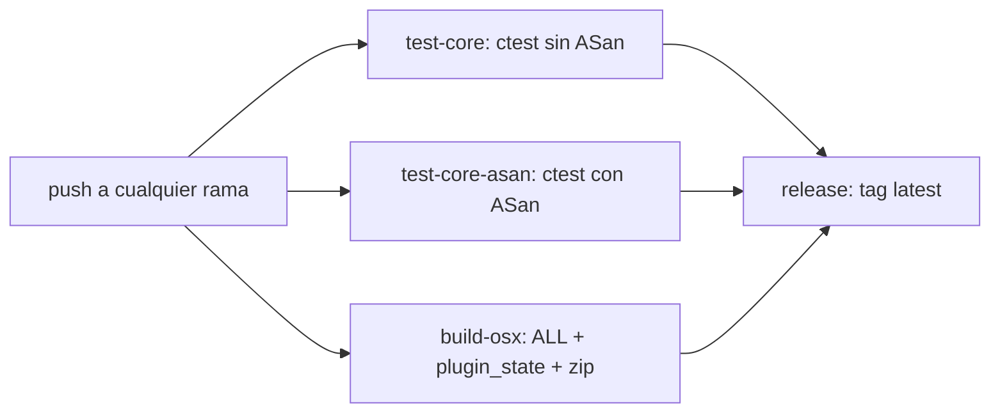

Runners `macos-26` (la release, `ubuntu-latest`, solo en `master`). `-Wall -Wextra` en el núcleo, que
compila sin avisos. Los bundles se suben comprimidos con `zip -r`: un directorio sin comprimir pierde
permisos y enlaces.

## 11. `re_stuff/`

No se compila. Rastro de la ingeniería inversa:

| Directorio | Contenido |
|---|---|
| `disasm/` | Desensamblados (RD200 A/B, MK80 B, MKS20 B). De aquí salen las direcciones del handshake |
| `verilog/` | IC8/IC9/IC19 + testbenches. *"probably most of them wrong"*: investigación, no verdad (trampa 6) |
| `luts/` | Caracterización de IC10/IC11: se reproducen con una exponencial; las LUT de los gate arrays solo bit a bit, como hace `sa_tables.cpp` |
| `silicon_tooling/` | JS/Python: de fotos del silicio a Verilog/KiCad/ELK |
| `ident_cells/` | Recortes de celdas estándar Fujitsu por tipo |
| `rom_tools/` | `descramble.c`, `descramble_wave.py`: antecesores de `rom_loader.h` |

## 12. Puntos frágiles

Decisiones que condicionan el trabajo futuro (los fallos concretos están en
[REVISION-CODIGO.md](REVISION-CODIGO.md)):

| # | Punto | Por qué pesa |
|---|---|---|
| 1 | Un solo firmware | El handshake por PC ata a `RD200_B.bin`; otro firmware = volver al desensamblado, o emular el protocolo de puertos de verdad. |
| 2 | Cambiar parche o afinación cuesta notas | El PC necesario apaga voces en el firmware; declick + espejo + reentrada reconstruyen, no continúan: lo sostenido solo por pedal no vuelve y la reentrada queda en ±6 dB. |
| 3 | Parche ↔ tasa de muestreo | Decide el ritmo de los LFO y obliga a dimensionar para 32 kHz; la tasa vive en `patchSampleRates[]` porque el bit del puerto 2 no funciona. |
| 4 | Dos hacks en `SoundChip::update()` | Parches sobre síntomas (`investigate`); el atajo decide qué slots se procesan. |
| 5 | Nadie juzga el timbre | Golden y vectores detectan cambios, no regresiones: hay que escuchar. |
| 6 | Memoria por instancia ≈ 2,4 MB | `SoundChip` 1,5 MB + páginas de params 512 KB + `RdBoard` 140 KB + ERAM de SpaceD 256 KB; las LUT (320 KB) se comparten. Es el precio de cambiar de parche en µs. |
| 7 | Bus de entrada imprescindible | Incorrecto de libro, pero sin él Logic no carga la AU (trampa 12). |

*Cuando código y documento discrepen, manda el código.*
