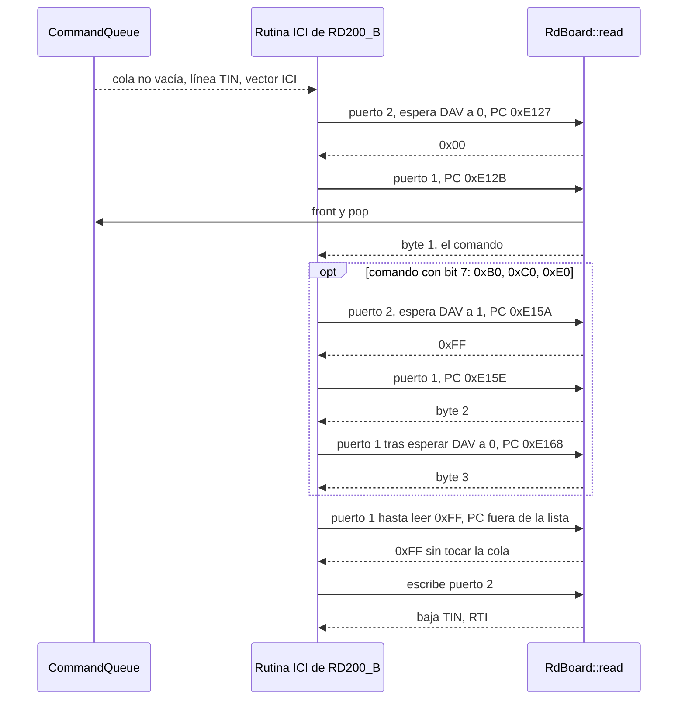

# Firmware: variantes, handshake y trazas retiradas

**Alcance:** qué firmware ejecuta el emulador, por qué solo ese, y qué se sabe de los otros. Recoge lo que
antes era código comentado en [mcu.cpp](../librdpiano/src/mcu.cpp) y en el `.jucer`, ya retirados.

## 1. Qué firmware se ejecuta

Solo **`roms/RD200_B.bin`** (8 KB), como ROM de programa de la CPU-B:

| Fichero | Máquina | Estado |
|---|---|---|
| `RD200_B.bin` | RD-1000 / RD-200, CPU-B | **El que se ejecuta** |
| `RD200_A.bin` | RD-1000 / RD-200, CPU-A | No se emula: la sustituye `sendMidiCmd()` |
| `mks20_cpub_1.0.bin` | MKS-20, CPU-B v1.0 | Alternativa conocida (§2) |
| `mks20_cpua_1.1.BIN` | MKS-20, CPU-A v1.1 | Ídem CPU-A |
| `MK80_B.bin`, `MKS20_A.BIN`, `MKS20_B.BIN` | Rhodes MK-80 / MKS-20 | Dumps sin usar |
| `RD200_IC5/6/7/18.bin` | RD-1000, onda y parámetros | Dumps sin usar: ningún parche los referencia |

De **onda y parámetros** se usan tres juegos (dos del MKS-20 y el del MK-80, `romSetFiles` en
[patches.h](../librdpiano/include/patches.h)): son los que distinguen los parches. Lo atado a una sola
variante es el **firmware**.

## 2. Por qué el firmware no es intercambiable: el handshake por PC

No se emula la CPU-A ni el bus entre las dos. `RdBoard::read` ([rd_board.h](../librdpiano/include/rd_board.h))
lo **simula** mirando el contador de programa: si la CPU está en una instrucción de la rutina de recepción
del firmware, el puerto 1 entrega el siguiente byte de la cola del `CommandPort`; si no, `0xFF`.



El PC que se compara es el de la instrucción **siguiente** a la lectura (`LDAA P1DR` en `0xE129` → PC
`0xE12B`), y los mensajes de un byte (`0x30`, `0x50`) no pasan por la rama de bit 7. Fuente:
`re_stuff/disasm/rd200_rom_b.asm`, `hdlr_TMR_IC`.

| Firmware | Puerto 1 (datos) | Puerto 2 (control) |
|---|---|---|
| `RD200_B.bin` (**en uso**) | `0xE12B`, `0xE15E`, `0xE168` | `0xE15A` |
| `mks20_cpub_1.0.bin` | `0xE0E4`, `0xE111`, `0xE11B` | `0xE10D` |

Cambiar de firmware **exige recalcular las cuatro direcciones** desensamblando su rutina de recepción
(`re_stuff/disasm/`); sustituir el fichero no basta. Las del MKS-20 se verificaron en su día, con
`mks20_cpub_1.0.bin` empotrado en el plugin; se dejó de empotrar (8 KB por binario que nada usaba) y el
fichero sigue en `roms/`. Ver también la trampa 1 de [CLAUDE.md](../CLAUDE.md).

## 3. El bit de sample rate del puerto 2

El firmware escribe en el puerto 2 (`0x0003`) un bit, `(data >> 2) & 1`, que en la máquina real elige la
tasa. El emulador lo leía en `Mcu::current_sample_rate`, pero **nunca funcionó**: no coincide con la tasa
real del parche. El campo se retiró; la tasa sale de `patchSampleRates[]` y llega a
`generate_next_sample(bool sampleRate32)`, en plugin y harness. Para retomarlo: la escritura del puerto 2
en `RdBoard::write`, comparada con `patchSampleRates[]`.

## 4. El bucle de ejecución y su "failsafe"

`Mcu::execute_run()` ejecuta **una instrucción** por llamada, y `generate_next_sample()` lo llama 100 veces
(62 a 32 kHz) por muestra. Hubo un bucle por presupuesto de ciclos, al estilo de MAME:

```cpp
do {
  if (m_icount > 10000)  // failsafe: el presupuesto nunca debería dispararse
    m_icount = 0;
  if (m_wai_state & (M6800_WAI | M6800_SLP))
    eat_cycles();
  else
    execute_one();
} while (m_icount > 0);
```

Se abandonó porque el reloj maestro es el audio: cuánto corre la CPU lo decide `generate_next_sample()`,
y `WAI`/`SLP` se atraviesan ejecutando instrucciones, no esperando.

| Resto del modelo de ciclos | Estado |
|---|---|
| `m_icount` + `increment_counter()` | **Retirados.** Nadie recargaba el contador: negativo en la primera instrucción y desbordamiento con signo (UB, lo aborta `-fsanitize=undefined`) a los ~5,9 min de audio. |
| `eat_cycles()` | No-op: lo llaman `WAI` y `SLP` en `mcu_ops.h`, código de MAME que no se reescribe. |
| `Mcu::cycles_63701[]` | Se conserva como punto de partida para retomar el modelo. |

**Ojo al retomarlo:** a ~2,9 ciclos por instrucción de media (medido con `cycles_63701[]`, sin contar la
entrada a interrupciones), 100 instrucciones por muestra a 20 kHz son ~5,8 MHz efectivos frente a los
2 MHz del chip real. Cerrar ese factor ~3 cambia la temporización del firmware y el sonido: movería los 16
hashes de `golden.txt`, que el harness detecta pero no juzga.
